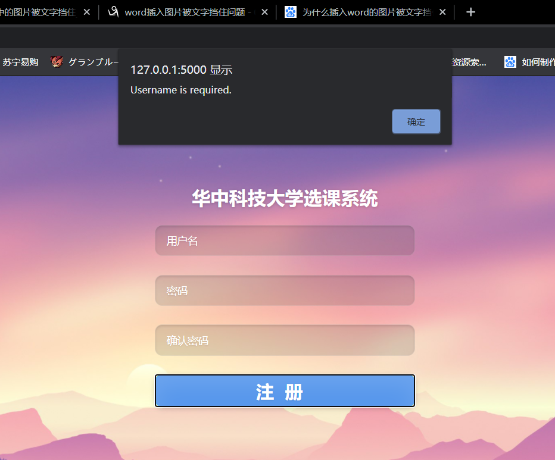
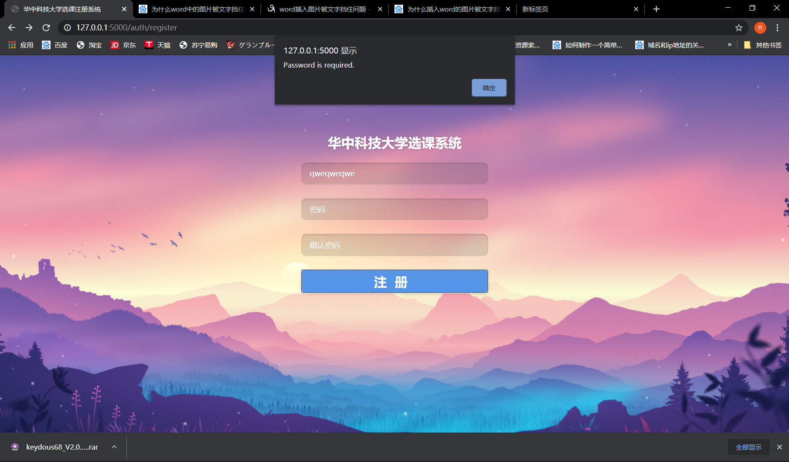
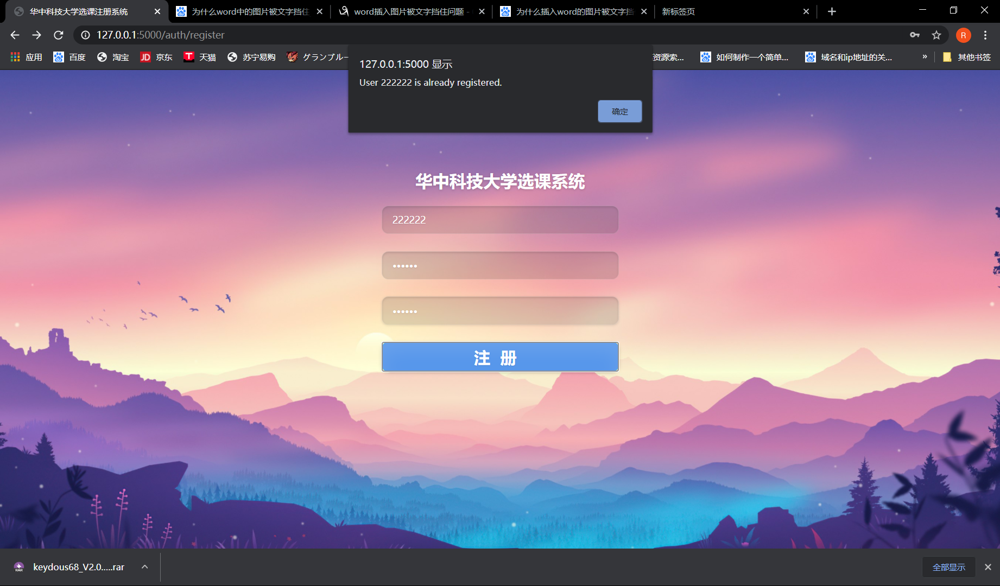
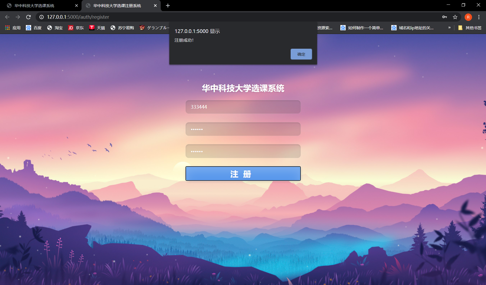
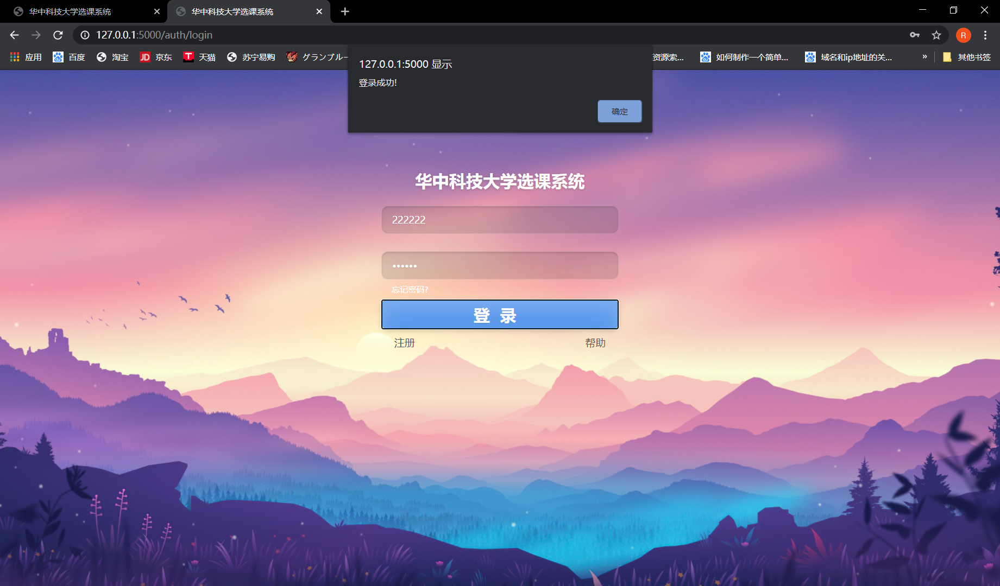
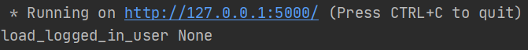
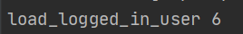
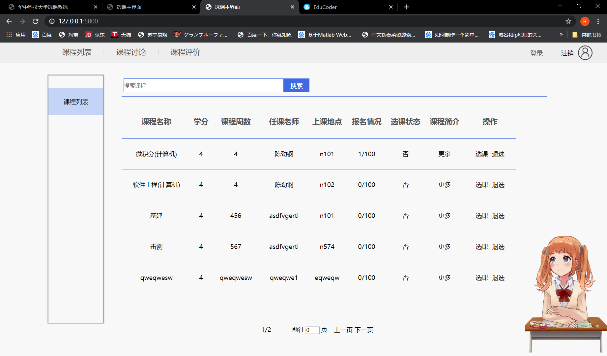
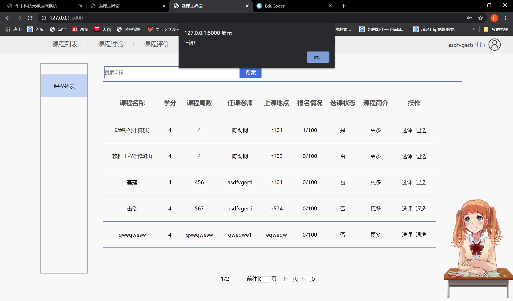

<!-- TOC -->

- [1. 系统实现](#1-系统实现)
  - [1.1. 运行环境](#11-运行环境)
  - [1.2. 关键函数说明](#12-关键函数说明)
    - [1.2.1. **init**.py(系统初始化模块)](#121-__init__py系统初始化模块)
    - [1.2.2. auth.py(auth 注册登录模块)](#122-authpyauth注册登录模块)
    - [1.2.3. hustcourse.py（主页模块）](#123-hustcoursepy主页模块)
- [2. 系统测试](#2-系统测试)
  - [2.1. 测试用例](#21-测试用例)
    - [2.1.1. auth.py（用户模块）](#211-authpy用户模块)
      - [2.1.1.1. register 函数](#2111-register函数)
      - [2.1.1.2. login 函数](#2112-login函数)
      - [2.1.1.3. load_logged_in_user 函数](#2113-load_logged_in_user函数)
    - [2.1.2. hustcourse.py（主页）](#212-hustcoursepy主页)
      - [2.1.2.1. index 函数测试](#2121-index函数测试)
      - [2.1.2.2. message2](#2122-message2)
  - [2.2. 结果分析](#22-结果分析)

<!-- /TOC -->

# 1. 系统实现

## 1.1. 运行环境

计算机环境: 使用的是 windows10 进行的开发。
处理器: Intel（R）Core（TM）i7-8750H @ 2.20Ghz 2.21Ghz
内存（RAM）: 16.0GB（15.9GB 可用）
系统类型: 64 位操作系统，基于 x64 的处理器
编程语言: python3.8
程序框架: 前端: vue，后端: flask，数据区: mysql
IDE: pycharm
实现语言: Python+Html5+CSS+Vue+JavaScript

## 1.2. 关键函数说明

### 1.2.1. **init**.py(系统初始化模块)

1. create_app 函数:
   入口参数: test_config=None(test_conig 为测试文档，默认为空)
   返回值: app（创建并初始化的 app 框架）
   功能: 完成 app 框架的初始化。
   实现: 首先进行 Flask 模块的初始化，先观察有无 test_config，如果没有 test_config 就加载默认的 config.py 文件，然后初始化数据库，在主 app 框架中注册对应的蓝图，完成 app 的构建后返回 app。

1. hello 函数
   入口参数: （@app.route(‘/hello’)(表示在网址后加上 hello 可访问此函数)）
   返回值: ‘Hello, World!’(测试用)
   功能: 完成教师邀请码的初始化。
   实现: 通过一个远程的页面，调用邀请码初始化的功能。通过调用 DB 数据库的 Add_Visitcode 添加邀请码。

### 1.2.2. auth.py(auth 注册登录模块)

1. response_t 函数
   入口参数: status=“200 OK”， headers=None
   返回值: resp（返回的 response 消息）
   功能: 将对应 headers 字典中的消息制作成消息头。
   实现: 返回消息头的 status 为当前的 status 参数，resp（返回消息）的头部信息中加入 headers 字典中对应的信息。

1. register 函数
   入口参数: @bp.route(‘/register’, methods=(‘GET’, ‘POST’))（即网页通过在主页后面加上/auth/register 触发此函数， auth 是 auth 模块的特定 url 前缀）
   返回值: 如果网页是 GET 请求，则返回 render_template(‘auth/register.html’)，如果是 POST 请求，则会返回对应的 response 消息。
   功能: 完成用户注册的后端功能，包括前端数据结构完备性检查，以及调用后端数据库的接口函数将前端获取的数据加入到数据库中，以及向前端返回对应的操作消息。
   实现: 首先判断其为什么请求类型，如果是 GET 请求，则返回 render_template(‘auth/register.html’)，如果是 POST 请求则首先获取前端的信息，得到前端传输的 username 和 password，然后调用数据库的查找函数，如果数据库中已经有相同用户名的用户，则不能重复注册，将报错信息传送给前端，如果数据库中不存在此次注册的用户名，则将其加入到数据库中，并向前端返回正确的提示信息。

1. login 函数
   入口参数: @bp.route(‘/login’, methods=(‘GET’, ‘POST’))(通过在主页后面加上/auth/login 来访问此函数)
   返回值: 如果网页是 GET 请求，则返回 render_template(‘auth/login.html’)，如果是 POST 请求，则视响应的情况返回对应的消息头。
   功能: 响应前端的 GET 请求，完成前端页面的显示，并根据前端传输的信息，在数据库中记性查询，并返回数据库中查询的结果，如果登陆出错则将出错信息弹窗到页面上，如果登陆成功，则跳转到主页面。
   实现: 如果是 GET 请求，则直接返回 render_template(‘auth/login.html’)，如果是 POST 请求，则先从前端的 request 中获取对应的 username 和 password 数据，然后将用户名在数据库中进行查询，如果数据库中不存在此用户名，则返回 Incorrect username.报错信息，如果前端输入的 password 和此用户名不对应的话，返回'Incorrect password.'，否则返回成功登陆的注册消息头。并且使用 session.clear()，然后将 session[“id”]变成数据库中的 user_id 的值。

1. load_logged_in_user 函数
   入口参数: @bp.before_app_request（每次 url 请求都调用此函数）
   返回值: 无
   功能: 时刻获取当前会话的 user 的信息，并将其保存在 g.user 全局信息中。
   实现: 每次调用都尝试使用 session.get 函数获取 login 中将其置为登陆用户的 user_id 获得，然后如果 user_id 不会 None 则调用数据库的接口将 g.uer 信息更新成数据库中的对应的 user 的信息。

### 1.2.3. hustcourse.py（主页模块）

1. index 函数
   入口参数: @bp.route('/', methods=('GET', 'POST'))
   返回值: 如果是 GET 请求，则通过数据库调用所有的信息后，返回使用 jinjia 模板渲染过的主页。
   功能: 能够展示当前所有的课程以及其信息，并且能够根据对应的按钮实现对应的功能。
   实现: 首先将课程分成计算机，电信，土木工程，水利，机械，材料和电气这 7 类，然后使用数据库的接口得到所有的课程信息，顺便得到所有的课程数量，如果数据库中含有课程，则遍历所有的课程，将每个课程信息分类存放到之前分类的课程列表中，同时通过每个课程的选课学生和当前会话的 g.user 进行比较，如果有则将前端对应的选课情况渲染成是，否则渲染成否。然后将对应的课程列表传到 jinjia 模板的变量中，利用 jinjia 对前端页面进行初始化。同时，登陆主页会尝试获取当前会话的 user，如果当前没有登陆，则在右上角会显示登录字样，如果有，但是用户没有设置自己的 Nickname，右上角会显示当前的用户名，如果用户设置了自己的 Nickname，则会显示自己的 Nickname，点击登陆会跳转到登陆界面，点击用户名或昵称会跳转到个人中心，点击注销会 clear 掉会话并刷新页面。

1. message1 函数
   入口参数: @bp.route('/message1', methods=('GET', 'POST'))
   返回值: 返回对应选课的反馈消息。
   功能: 实现选课和退选功能。
   实现: 首先，只有登录了之后才能进行选课和推选，所以函数会先获得 g.user 如果 g.user==None，则返回报错信息 login first 给前端，如果当前登录的用户权限（Role）不为学生（2），则返回报错信息，you are not a student，只有当当前登录的用户是学生的时候，其点击选课和退选，首先已经从 g.user 中获得了当前登录的用户名，然后前端会向服务器发送其选的课程的名称和动作，动作包括选课和退选，其中选课和退选的不重复保证采用的是前端保证的。有了这些信息后，根据其动作（选课或退选）调用对应的数据库函数，如果发生了数据库的报错，则将数据库报错作为消息头的 error 部分传递给前端，如果数据库操作正常的话，将返回给前端一个操作正常的消息，并且刷新页面，然后因为之前的 index 函数中，每次加载会调取数据库中的所有信息，因此刷新再加载后，这里以选课为例，就可以看到对应人数+1，选课状态从否变成了是。

1. message2 函数
   入口参数: @bp.route('/message2', methods=('GET', 'POST'))。
   返回值: 返回对应的消息头。
   功能: 实现用户注销功能。
   实现: 如果当前会话中没有登录，则返回错误的报文，报错 please login first，如果当前有用户登录，则使用 session.clear()断开当前会话，并返回正常反馈给前端。

1. user 函数
   入口参数: @bp.route('/user', methods=('GET', 'POST'))
   返回值: 响应网页的 GET 请求返回 jinjia 渲染后的页面
   功能: 实现个人中心的页面，能够针对不同身份的人进行不同身份的显示。
   实现: 如果当前的 g.user==None 即没有登陆的话，会直接返回一个请登陆的页面，如果当前有登录的用户，则获取其用户名，如果其身份为学生，根据其用户名获得其选择的所有课程，然后存放到一个列表中，通过 jinjia 模板进行渲染，这样每个不同的用户，都可以实现自己的个性化的选课概况的显示，分别显示的是每个用户选择的课程和选上课程的成功率，如果当前选课人数小于最大课程人数，则选课成功率为 100%，否则按照对应的概率公式进行计算。页面的左边分别是更改个人信息和退出登录的按钮。如果用户的身份是老师，则会显示其发布课程的情况，包括每个课程的名字和当前选择该课程的人数。

1. class_info 函数
   入口参数: id（对应 url 中的 course_id），@bp.route('/<int:id>/class_info', methods=('GET', 'POST'))
   返回值: 返回对应渲染后的 class-inf.html 页面。
   功能: 根据传入的特定课程的 url 返回对应渲染的页面。
   实现: 首先通过 url 中的 id 调用数据库函数接口，获得当前的课程名称，然后通过数据库结果获得当前课程的所有信息，将其中的 teacherid 使用数据库接口变成 teacher 用户的 username，将其中的 Type 经过映射，然后传递给前端页面进行渲染。

1. class_info2 函数
   入口参数: @bp.route('/class_info2', methods=('GET', 'POST'))
   返回值: 返回对应操作后的 response 消息。
   功能: 通过前端的 post 信息生成特定的 url 以供 class_info 函数使用。
   实现: 首先获得前端传递给后端的消息，将其中的 coursename 获取出来，
   然后尝试使用这个 coursename 获取对应的课程信息，如果对应的课程信息不存在，则返回的 response 消息头的 status 为 1，error 为 this class don\'t exist!，如果获取成功，则对应的消息头的 status 为 0，对应的 url 使用'./'+str(course_info['id'])+'/class_info'生成，并作为 response 的参数传递给前端进行跳转。

1. setting 函数
   入口参数: @bp.route('/setting', methods=('GET', 'POST'))
   返回值: 如果网页的请求是 GET，则返回当前数据库中存在的数据渲染后的页面，如果网页的请求时 POST，则返回对应操作后的 response 消息头。
   功能: GET 请求时显示当前用户在数据库中已经填写的数据，POST 请求时根据其填写的数据完成用户在数据库中数据的更新。
   实现: 首先查询当前是否有用户登录，如果没有，返回提示登录页面，如果前端的请求是 GET 请求，那么首先从 g.user 中获得当期登录用户的用户名，然后根据用户名去数据库中查询用户响应的数据信息，对于 Sex 性别信息，数据库中存放的是 0,1 因此还有进行一次转换。对于用户的信息，如果查询到了就显示用户数据库中的信息，如果用户对应的数据库中的信息不存在，则显示空字符串。如果对应的是 POST 请求，首先从前端中得到对应的消息，检查是否是所有必填项都填了，如果有必填项没填，则向前端返回对应的报错信息，具体到第一个没填的必填项，如果此必填项都填了，则将 Sex 对应的项由男，女转换成数据库中对应的存储形式 0,1 或者 None，然后注意 post 的数据中是否有 invisit 这一项，这一项对应的是邀请码，如果有这一项，则使用数据库接口将此用户和此邀请码绑定，如果绑定出错，给前端返回对应的报错信息，如果绑定成功，将此用户的权限升级为老师，然后更新此用户在数据库中的信息，如果更新成功，则向前端返回更新成功的消息。

1. classinfo 函数
   入口参数: @bp.route('/classinfo', methods=('GET', 'POST'))
   返回值: 如果是 Get 请求，则返回对应的课程发布页面，如果是 POST 请求则返回对应的 response 消息头。
   功能: 实现老师发布新课程。
   实现: 如果当前用户没登录或者登录的身份不是老师，则返回提示登录页面，如果当前登录的用户是老师身份，页面是 GET 请求，则返回发布课程的页面。如果对应的请求是 POST 首先获得前端的信息，然后将前端的信息拆分，将对应的信息统一成数据库中的课程信息，其中 Type 转换成字符串 1 到 7 的形式，然后获取前端填写的老师用户名，将老师的用户名和填写的课程作为参数调用 Create_Course 创建新的课程，如果创建成功则向前端返回成功的反馈，否则返回对应的出错信息。

1. class_discussion 函数
   入口参数: @bp.route('/class_discussions', methods=('GET', 'POST'))
   返回值: 如果网页是 GET 请求，则返回对一个渲染后的页面，如果网页是 POST 请求，则返回对应的 response 消息头。
   功能: 实现自由讨论区的功能。
   实现: 如果是 GET 请求，则首先访问数据库，调出其所有的讨论记录，并在右上角实现和主页面一样的登录，注销函数，将所有的讨论都渲染到前端页面上，如果对应的是 post 请求，则首先要看其是否登录，如果没有登录，则返回提示登录信息，否则将 post 中的 msg 信息获取，然后获取 g.user 全局会话中的 username，调用数据库接口将新用户的评论添加到讨论数据库中，时间戳自动生成。

1. message_x 函数
   入口参数: @bp.route('/message_x', methods=('GET', 'POST'))
   返回值: 根据对应的处理结果返回对应的 response 消息头。
   功能: 完成特定课程的 url 生成。
   实现: 首先从前端获得前端传入的课程名称，然后为了方便查询，将其中的中文括号转化成英文括号，然后调用数据库接口获得所有的课程名称，如果输入的课程名称不在现在的课程数据库中，则返回对应的报错信息，否则，按'http://127.0.0.1:5000/'+str(course_id)+'/class_comments'的规则生成对应的url并将其传递给前端页面。

1. class_comments 函数
   入口参数: course_id，@bp.route('/<int:course_id>/class_comments', methods=('GET', 'POST'))
   返回值: 如果页面是 GET 请求，则返回对应 render_template 的渲染后的页面，如果是 POST 请求，则返回对应处理后的 response 消息头。
   功能: 实现针对特定课程的评价区。
   实现: 如果页面是 GET 请求，首先从 url 中获取课程的 course_id，然后根据 course_id 获得课程名称，然后根据课程名称，获取课程对应的评价区，并使用 jinjia 模板渲染将其装载到前端页面。在右上角实现和主页面相同的登录和个人中心功能。如果前端页面是 POST 请求，如果当前用户没有登录，则返回提示登录信息，如果当前用户不在此课程的成员中，则返回不在此课程的报错信息，因为只有参与了课程的学成才能进行评价，然后调用数据库进行 comments 的上传，上传成功则向前端返回正确评论的消息。

# 2. 系统测试

## 2.1. 测试用例

### 2.1.1. auth.py（用户模块）

#### 2.1.1.1. register 函数

用户注册模块，首先要判断用户填写的数据是不是符合我们对数据的要求，如果用户填写的数据不符合我们的要求，则要返回响应的报错。

| 用例描述                                                       | 结果                                                                         | 截图               |
| -------------------------------------------------------------- | ---------------------------------------------------------------------------- | ------------------ |
| 用户不填用户名的情况                                           | 返回报错信息，Username is required 提示用户没有输入用户名。                  |  |
| 用户不输入密码                                                 | 网页返回了报错信息，Password is required，提示用户没有输入密码。             |  |
| 之前注册了一个用户名为 222222 的用户，这里如果我们尝试重复注册 | 返回报错信息 User 222222 is already registed，提示当前用户名已经被注册过了。 |  |
| 正确注册之后                                                   | 页面会成功跳转                                                               |  |

#### 2.1.1.2. login 函数

根据 login 函数的实现，我们可以知道，login 函数有种情况

1. 用户输入的用户名不在数据库中
2. 用户的用户名在数据库中，但是密码不对应。
3. 成功登陆

我们分别就这三个情况进行测试:

| 用例描述                     | 结果                                                                                                      | 截图               |
| ---------------------------- | --------------------------------------------------------------------------------------------------------- | ------------------ |
| 用户输入的用户名不在数据库中 | 网页成功的返回了 Incorrect username.                                                                      |  |
| 用户输入的密码和用户名不对应 | 我们输入了 222222 和 111111，222222 对应密码也是 222222，这里密码不对应，因此返回的是 Incorrect password. |  |
| 成功登陆的情况               | 当登陆成功时，会返回一个登陆成功的弹窗，点击确定后会自动跳转到主页面中。                                  |  |

#### 2.1.1.3. load_logged_in_user 函数

我们测试其有用户登录和没有用户等的两种输出情况

| 用例描述   | 结果                                                                                                          | 截图               |
| ---------- | ------------------------------------------------------------------------------------------------------------- | ------------------ |
| 无用户登录 |                                                                                                               |  |
| 有用户登录 | 成功登录的时候会得到对应的会话的 user_id，有了 user_id 我们便可通过数据库结果获取用户的信息。方便后续的操作。 |  |

### 2.1.2. hustcourse.py（主页）

#### 2.1.2.1. index 函数测试

index 测试，index 只负责主页面的加载和渲染，所以我们仅需测试不同情况下的主页面的变化。我们分成三个测试

1. 无登录状态的测试。
2. 登录状态的测试
3. 注销的测试、
   关于对应从数据库中加载所有的课程的功能和其他的一些功能将在后面对应的特定函数进行测试。

| 用例描述         | 结果                                                                               | 截图                |
| ---------------- | ---------------------------------------------------------------------------------- | ------------------- |
| 无登录状态的测试 | 可以看到右上角的状态是登录和注销，此时点击登陆，会跳转到登录页面。登陆页面可见上文 |  |
| 登录状态的测试   | 以 222222 身份登录之后，主页的右上角将会变成对应用户的用户名或昵称                 |  |
| 注销的测试       | 此时我们点击注销，会登出我们的登录状态，变成登录前的样子                           |  |

#### 2.1.2.2. message2

由于上面的主页已经测试了正常使用的结果，所以我们此处仅测试没有登录情况下的注销功能

**_由于测试用例较多，省略之后的测试用例描述_**

## 2.2. 结果分析

根据测试分析运行结果、确认软件是否满足需求。
由测试结果图 1，2，3，4 可知，其能够完成用户账号的创建以及前后端消息的通信。并且能够根据对应前端的数据中的一些错误向前端返回一定的报错信息，确认数据无误后将其装入用户数据库中。用户注册功能完整实现。
由测试结果图 5，6，7，所示，可以看到，用户登录模块可以获得前端传入的数据，并且检查前端传递过来的数据是否正确，如果不正确，向其返回对应的报错信息，如果正确向前端返回一个登录成功的消息，其中数据正不正确是通过调用数据库接口函数实现的查找。
由测试结果 10,11，12，13 可以看到，主页每次进来都可以从数据库中加载所有的数据并将主页进行渲染，并且能够根据当前用户的登录状况将右上角的用户登录情况变为对应的用户名或者昵称，或者是登录按钮，并且能够实现课程的按类管理。
由测试结果图 13,14 可知，注销功能是可以正常使用的。
由测试结果图 15，16,17，18，19 所示，可以看到对于用户未登录状态，主页可以显示课程，但是不能选课，选课则会报出请先登录的报错，如果用户的身份不是学生，则点击选课和退选按钮，会弹出报错信息 you are not a student，对于连续选课的情况，也会报出对应不能重复选课和退选的报错，选课或退选成功时会成功向前端发送正确选课的反馈，并且调用数据库函数，将对应的选课或者退选操作在数据库上实现。由此可见，用户选课、退选模块成功实现。

由图 20，21，22，23，24，25 分别可知，对于个人中心模块，能够显示其学生正常的个人中心页面（游客和学会使用的是同一套页面框架），对于学生的个人中心可知，当对应的学生成功选择了一项课程之后，能够在他对应的个人中心页面成功的显示出来对应的选课情况，对应学生进行退选之后，能够成功的在各人中心页面进行实时的信息更新。能够根据用户登录当前的身份自动的加载不同的个人中心页面，如果个人用户的身份是老师，可以自动加载老师对应的个人中心页面，老师的个人中心包含的不是选课名称和选课概率而是发布的课程名称和对应选课课程的选课人数。在老师发布新课程之后，能够在个人中心实时更新的新发布的页面。对于没有登录的页面，会自动跳转到请登录的页面，由此可见可以看到个人中心模块能够成功实现。

由图 27，28，29，30，31，32，33，34，35，36 可以看到对于用户未登录的情况，是无法跳转到个人信息更改页面的，对于用户必填项没填的情况，是会根据其对应的没填的表项进行报错，也能根据填写的信息成功注册成对应的身份，对应邀请码的报错也能在后台检测并返回前端对应的报错信息。能调用数据库的接口函数正确更新对应用户的信息。由此可以看到，用户个人信息更新模块能够成功实现。

由图 26，37，38，39，40,41 可知，能够对特定的课程显示对应课程的信息，能够以老师的身份发布新的课程，发布的新课程能够在首页中显示出来，对于老师不存在和课程名称重复的报错也会输出到前端，如果操作成功则会在课程数据库中加入此课程数据。由此可见，课程模块能够成功实现。

由图 42，43，44 可知，课程讨论模块可以让未登录的用户也有权观看，但是只有登录的用户才能进行发言，发言成功后能够将对应的数据载入到数据库宏，然后再次进入讨论区时，会看到刚才的发言，发言按照发言的时间先后顺序进行排列。课程讨论模块能够成功实现。

由图 45,46，47,48，49 可知，课程评价模块也可以允许未登录的用户观看，但是对于想要发言的用户，则必须是选此课的学生才行，成功发言之后，也会想讨论区一样按照发言的时间先后顺序进行排列。
