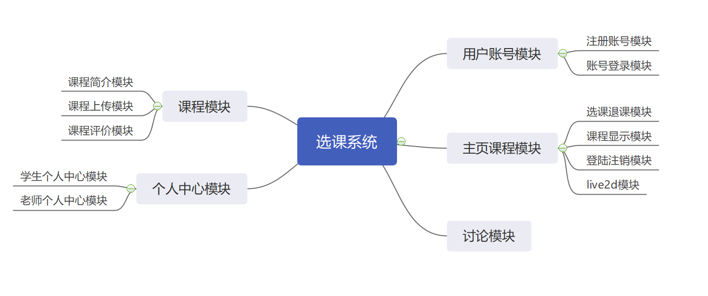
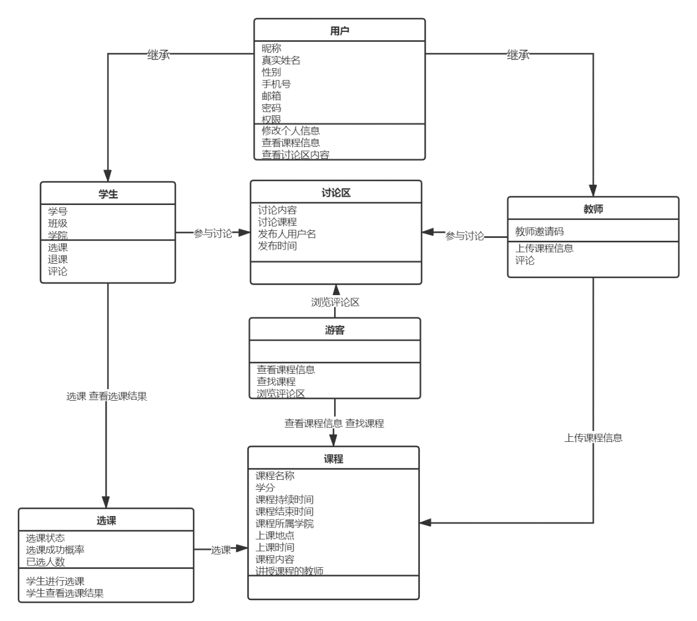
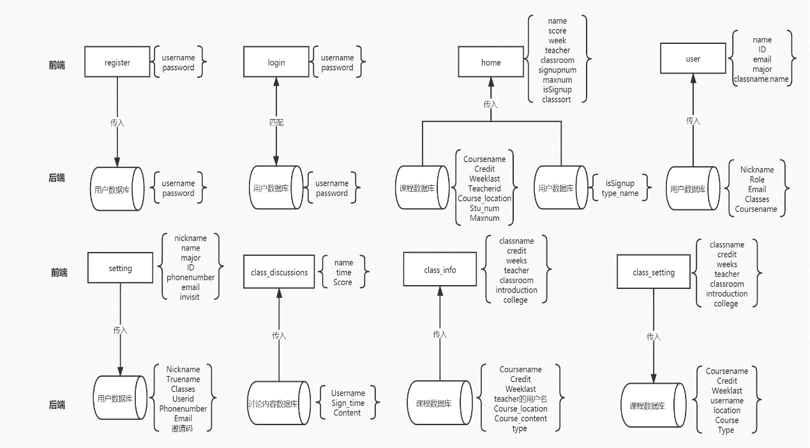

<!-- TOC -->

- [1. 系统结构](#1-系统结构)
  - [1.1. 前端系统结构](#11-前端系统结构)
  - [1.2. 后端系统结构](#12-后端系统结构)
  - [1.3. 系统结构图: ](#13-系统结构图)
  - [1.4. 系统类图](#14-系统类图)
  - [1.5. 关键数据结构定义](#15-关键数据结构定义)
    - [1.5.1. 前端数据结构](#151-前端数据结构)
    - [1.5.2. 用户数据项结构设计](#152-用户数据项结构设计)
    - [1.5.3. 课程数据项结构设计](#153-课程数据项结构设计)
    - [1.5.4. 邀请码数据项结构设计](#154-邀请码数据项结构设计)
    - [1.5.5. 课程-学生关系表结构设计](#155-课程-学生关系表结构设计)
    - [1.5.6. 课程讨论结构设计](#156-课程讨论结构设计)
    - [1.5.7. 数据关联结构设计](#157-数据关联结构设计)
  - [1.6. 关键算法设计](#16-关键算法设计)
    - [1.6.1. 数据库的 API 接口算法设计](#161-数据库的api接口算法设计)
    - [1.6.2. 后端的 API 接口算法设计](#162-后端的api接口算法设计)
  - [1.7. 数据管理说明](#17-数据管理说明)
    - [1.7.1. 使用数据库概述](#171-使用数据库概述)

<!-- /TOC -->

<a id="markdown-1-系统结构" name="1-系统结构"></a>

# 1. 系统结构

<a id="markdown-11-前端系统结构" name="11-前端系统结构"></a>

## 1.1. 前端系统结构

前端系统分为 9 个模块:

1. 注册账号模块。注册功能分为六个步骤，填入用户名、填入密码、填入确认密码、点击注册按钮、传递用户信息的后端管理判断、后台返回响应。
2. 账号登入模块。主要的登录功能分为五个步骤，填入用户名、填入密码点击注册按钮、传递用户信息的后端管理判断、后台返回响应。
3. 修改密码模块。
4. 选课主界面模块。主要功能: 提供给学生选课退课、提供给所有用户利用课程名字或者课程分类来检索课程。提供给所有用户跳转到其他页面的按钮。
5. 个人信息界面模块 。主要功能: 提示用户当前的身份（学生、老师、管理员）、基本的个人信息，以及已经选择的课程和选择课程的成功率是多大，提供给所有用户跳转到其他页面的按钮。
6. 个人信息修改界面模块。主要功能: 提供用户修改个人基本信息，能够修改用户的身份。提供给所有用户跳转到其他页面的按钮。
7. 课程讨论界面模块。主要功能: 可以给学生、老师进行发言，发言会公布到页面中去。
8. 课程评价界面模块。
9. 老师上传课程界面模块。主要功能: 老师填写课程的信息，课程能够上传到选课主页面中。
   <a id="markdown-12-后端系统结构" name="12-后端系统结构"></a>

## 1.2. 后端系统结构

后端系统的功能模块分为用户账号模块，主页课程模块，课程模块，讨论模块。个人中心模块。

1. 其中用户账号模块包括用户账号注册，用户账号登陆子模块。
   1. 用户账号注册模块实现用户注册页面的展示，用户创建账号的数据提交与收取，数据检验和数据入库，以及前端反馈等功能。
      对应的接口为 register 函数，通过'/register'访问，可接受前端传入的 post 数据，进行数据结构检错后调用数据库进行用户数据库的更新，并向前端传递对应的响应信息。
   1. 用户账号登陆子模块实现用户登录页面的展示，用户登录的数据提交与收取，数据检验和数据入库，以及前端反馈等功能。
      对应的接口为 login 函数，通过'/login'访问，可接受前端传入的 post 数据，进行数据结构检错后调用数据库进行数据的查找，并向前端传递对应的响应信息。
1. 主页课程模块包括选课，退课模块，课程显示模块，登录注销模块，live2d 模块等子模块。
   1. 选课，退课模块实现了特定用户对某一个课程的选课，退课的功能。
      对应的接口为 message1，通过用户前 吧端传过来的操作，完成对应选课退选操作后，将对应数据更新到数据库中。并向前端传递操作消息。
   1. 课程显示模块实现了从数据库中加载所有的课程信息并显示，并且可以根据对应的分类符分类显示课程的功能。还能根据数据库进行实时的课程页面更新（需要刷新页面）。还提供了跳转课程更多信息页面的跳转链接。
      对应的接口为 index，能够展示当前所有的课程以及其信息，并且能够根据对应的按钮实现对应的功能。
   1. 登陆注销模块实现了课程主页的快速登陆和注销的功能。
      对应的接口为 message2:实现用户注销功能。
   1. live2d 模块实现了网站的 live2d 美化功能。
      此部分由网页 js 部分实现。
1. 课程模块包括课程简介模块，课程上传模块，课程评价模块等子模块。 1. 课程简介模块实现了根据对应课程显示对应课程的对应信息功能。
   对应接口为 class_info2(): 通过前端的 post 信息生成特定的 url 以供 class_info 函数使用。
   和 class_info(id): 根据传入的特定课程的 url 返回对应渲染页面。 1. 课程上传模块实现了老师用户发布新的课程功能。
   对应的接口为 classinfo(): 从前端获取信息，将其送入数据库中，实现老师发布新课程功能。 1. 课程评价实现了可查看特定课程的评价区，并只有选择过该课程的学生才能进行评价，评价按时间先后排序。
   对应接口为 message_x()和 class_comments(course_id)，分别完成特定的课程 url 生成，和特定课程评价区的实现。
1. 讨论模块包括讨论区模块子模块。
   1. 讨论区实现了能够在其中自有讨论的功能，顺序按时间排序。
      对应接口为 class_discussion()，从数据库中读取当前所有讨论的信息，并能够从前端向数据库进行信息的更新，实现自由讨论区的功能。
1. 个人中心模块包括学生个人中心模块，老师个人中心模块等子模块。
   1. 学生个人中心模块实现了可按照特定学生的情况显示其对应的选课状况。
   1. 老师个人中心模块实现了可安特定老师的情况显示其对应的发布的课程情况。
      对应接口均为 user()和 setting()，实现个人中心的页面，能够针对不同身份的人进行不同身份的显示。以及对应个人信息的更新。

<a id="markdown-13-系统结构图" name="13-系统结构图"></a>

## 1.3. 系统结构图:



<a id="markdown-14-系统类图" name="14-系统类图"></a>

## 1.4. 系统类图



<a id="markdown-15-关键数据结构定义" name="15-关键数据结构定义"></a>

## 1.5. 关键数据结构定义

<a id="markdown-151-前端数据结构" name="151-前端数据结构"></a>

### 1.5.1. 前端数据结构

1. 登入界面主要数据: username、password 分别绑定前端页面的用户名输入框和密码输入框中的内容，并通过 axios 打包传递给后端服务器进行关联。
2. 注册界面主要数据: username、password、repassword 分别绑定前端页面的用户名输入框和密码输入框、确认密码输入框中的内容，并并通过 axios 打包传递给后端服务器进行关联。
3. 选课主界面主要数据: message 是一个具体的字典数组，数组中元素是用来存储每门课的基本信息的，数组元素具体格式如下:
   ```js
   message:{
       name     : " ",   //name表示课程的名字
       score    : " ",   //score表示课程的学分
       week     : " ",   //week表示课程的上课时间
       teacher  : " ",   //teacher表示上课的老师
       classroom: " ",   //classroon表示上课的地点
       signupnum: 0,     //signupnum表示当前报名人数
       maxnum   : 100,   //maxnum表示课程最大人数
       isSignup : " ",   //isSignup表示当前用户是否报名改课程
       classsort: " "    //classsort是这门课程的具体分类
   }
   ```
4. 个人信息界面主要数据: userinf 是一个字典，字典用来存储个人信息，字典具体格式如下:

   ```js
   userinf:{
       name : " ",   //name表示用户的昵称
       ID   : " ",   //ID用来表示用户的身份（游客、教师、学生），
       email: " ",   //email表示用户的电子邮箱
       major: " ",   //major用来表示用户的班级
   }
   ```

   classname 是一个具体的字典数组，数组中元素是用来存储用户已经选择的每门课的名字以及选课成功率，数组元素具体格式如下:

   ```js
   classname:{
       name       : " ",   //name表示用户选择的课程的名字
       chenggonglv: " "    //chenggonglv表示该课程选课的成功率。
   }
   ```

5. 个人中心主要数据: inf 是一个具体的字典，字典是用来存储用户的基本信息的，字典具体格式如下:
   ```js
   inf:{
       nickname   : " ",   //Nickname用来表示用户的昵称
       name       : " ",   //name用来表示用户的真实姓名
       major      : " ",   //major用来表示用户的班级
       ID         : "",    //ID用来表示用户的学号
       phonenumber: "",    //phonenumber用来表示用户的电话号码
       email      : 0,     //email用来表示用户的邮箱
       invisit    : " "    //invisit用来储存教师邀请码
   }
   ```
6. 课程讨论界面主要数据: message 是一个具体的字典数组，数组中元素是用来存储用户讨论的基本信息的，数组元素具体格式如下:
   ```js
   message:{
       name: " ",   //Name用来表示用户的昵称
       msg : " ",   //msg用来表示用户的讨论内容。
   }
   ```
7. 课程简介界面主要数据: inf 是一个具体的字典，字典是用来存储课程的基本信息的，字典具体格式如下:
   ```js
   inf:{
       classname   : " ",   //classame用来表示课程名字
       credit      : " ",   //credit用来表示课程学分
       weeks       : " ",   //weeks用来表示课程具体时间
       teacher     : " ",   //teacher用来表示课程老师
       classroom   : " ",   //classroom用来表示课程上课地点
       introduction: " ",   //introduction用来表示课程介绍
       college     : " "    //college用来表示课程学院
   }
   ```
8. 教师上传课程界面主要数据: inf 是一个具体的字典，字典是用来存储课程的基本信息的，字典具体格式如下:
   ```js
   inf:{
       classname   : " ",   //classame用来表示课程名字
       credit      : " ",   //credit用来表示课程学分
       weeks       : " ",   //weeks用来表示课程具体时间
       teacher     : " ",   //teacher用来表示课程老师
       classroom   : " ",   //classroom用来表示课程上课地点
       introduction: " ",   //introduction用来表示课程介绍
       college     : " "    //college用来表示课程学院
   }
   ```

<a id="markdown-152-用户数据项结构设计" name="152-用户数据项结构设计"></a>

### 1.5.2. 用户数据项结构设计

用户数据项的表项代码设计如下:

```python
#对应每个用户由一个信息大表记录，后续再通过多复杂关系修改该表
#一个用户的数据表项
class User(db):
    __tablename__ = 'users'
    id            = Column(Integer,primary_key = True,autoincrement=True)
    Username      = Column(String(255),unique = True) #一个人的昵称，要有唯一性
    Truename      = Column(String(30)) #一个人的真实姓名，可能有重名的现象
    Sex           = Column(Integer) #性别 0代表男，1代表女
    Phonenumber   = Column(String(60)) #电话号
    Nickname      = Column(String(50)) #昵称
    Userid        = Column(String(30),unique=True) #一个人的学号，具有唯一性
    Email         = Column(String(50),unique=True) #一个人的邮箱，具有唯一性
    Password      = Column(String(255)) #加密的密码
    Sign_time     = Column(DateTime,default=datetime.datetime.now)
    Role          = Column(Integer,autoincrement=False)#表示某一个用户的权限等级, 有 0:'admin', 1:'teacher', 2:'student'
    Classes       = Column(String(30)) #班级
    College       = Column(String(30)) #学院
    def check_password(self,password):
        return check_password_hash(self.Password,password)
```

上表为一个具体的用户数据项表，将老师，学生，以及管理员抽象为一种数据类型，表名定义为 users，其他成员具体解释如下:

1. Id: 为数据库存取时的唯一索引，具有自增属性，数值为数据库自动为其分配。
1. Username: 该用户的用户名，具有唯一性，为该用户逻辑上的唯一标识，Username 在用户注册时，自己命名。
1. Truename: 对于选课系统来说，需要用户的真实姓名，考虑到真实应用场景，故每个用户提供一列以字符串形式保存真实姓名。
1. Sex: 用户性别，为了方便读取时的判别，故设计为整型，且只有两种理论值，0: 男，1: 女。
1. Phonenumber: 用户的手机号，以字符串形式存储，具有唯一性。
1. Nickname: 用户昵称，区别于用户名（仅自己可见，为逻辑唯一标识），昵称为对外显示，非高权限（如选课老师）可见的标识。
1. Userid: 用户的学号，对身份为学生的用户有效，同样区别于 id，id 为数据库分配的自增唯一索引，而 Userid 为学校分配的 id。
1. Email: 用户的邮箱，具有唯一性，之后可以用作验证。
1. Password: 用户的密码，密码为用户自己设置的，为了保证私密性，故在数据库中使用了哈希加密，在外层调用接口时，只能调用接口的验证函数，无法获取密码的表项。
1. Sign_time: 用户注册的时间，用作特殊记录用。
1. Role: 表示用户的身份，与 Sex 的方式类似，使用整型来记录，0 代表管理员，1 代表老师，2 代表学生；
1. Classes: 用户当前的课程定义；
1. College: 用户当前的学院，为必填项；
1. 函数成员 check_password(): 为封装的密码查询，保证外部调用无法直接获取密码。

<a id="markdown-153-课程数据项结构设计" name="153-课程数据项结构设计"></a>

### 1.5.3. 课程数据项结构设计

```python
class Course(db):
    __tablename__ = 'courses'
    id            = Column(Integer, primary_key=True, autoincrement=True)
    Coursename    = Column(String(40), nullable=False,unique=True)
    State         = Column(Integer,nullable=False) #表示当前课程状态，0为预备
    Credit        = Column(String(10)) #表示学分
    Weeklast      = Column(String(20))
    Deadline      = Column(String(40))
    Type          = Column(String(20),nullable=False) #课程类别，0默认为未分类

    #总人数
    Allstu = Column(Integer)

    #上课地点
    Course_location = Column(String(50))
    #课程描述
    Course_content = Column(String(1024))
    #上课人数
    Stu_num = Column(Integer,nullable=False)
    #上课时间
    Course_time = Column(String(100)) #采用格式化字符串的形式，存储上课的时间信息
    #每个课程关联唯一的一个负责老师
    Teacherid = Column(Integer, ForeignKey('users.id'))
    #学生与课程的多对多关系
    String_state = Column(String(100))
    Stus         = relationship('User', secondary=Course_stu,
                        #cascade = "delete, delete-orphan",
                        backref  = 'Courses',               lazy = 'dynamic')
```

以上为课程项表，即表示一个课程的所有信息。

1. Coursename: 该课程名，具有唯一性，同时也是逻辑意义上的课程唯一标识，接口函数多以此为查找索引。
1. State: 表示当前课程的状态，分为预选和完成状态，在预选阶段允许人数超额，在预选结束，课程人数固定。0 表示为预选，1 表示为成功选上；
1. Credit: 记录该课程的学分，为整型；
1. Weeklask: 表示该课程持续的周，为字符串存储；
1. Deadline: 表示课程的截止日期，为字符串形式；
1. Type: 课程类别，使用字符串，以字节流的形式存储，来表示该课程属于哪一个学院的；
1. Allstu: 表示目前选该课程的人数，为整型；
1. Course_location: 表示课程的上课地点，以字符串形式；
1. Course_content: 表示课程内容描述，以字符串形式保存，最大允许长度为 1024，为老师发布；
1. Stu_num: 上课人数，即当课程结束预选状态后，用来保存课程成功选课的人数；
1. Course_time: 表示课程上课时间，以字符串形式保存；
1. Teacher_id: 因为每个课程对应一个唯一的老师，故使用外键，将一个老师 id 做为一个课程的唯一索引；
1. String_state: 表示学生的选择状态，以字符串字符流来表示；
1. Stus: 构建课程与学生的多对多映射，以 Couses 为反向映射键，具体定义在 table 中。

<a id="markdown-154-邀请码数据项结构设计" name="154-邀请码数据项结构设计"></a>

### 1.5.4. 邀请码数据项结构设计

邀请码的结构如下:

```python
#存储邀请码的表项
class Visit(db):
    #存储邀请码的库
    __tablename__ = 'visits'
    id            = Column(Integer,primary_key=True,autoincrement=True)
    Visit_code    = Column(String(50),unique=True)
    #一对一的关系
    Teacherid = Column(Integer,ForeignKey('users.id'))
#
```

邀请码表项包括:

1. Visit_code: 邀请码，以字符串表示
1. Teacherid: 一个邀请码最多只能绑定一个老师，即在未使用时，该列为 None，在绑定之后变为对应老师的 id，不允许多次绑定；

<a id="markdown-155-课程-学生关系表结构设计" name="155-课程-学生关系表结构设计"></a>

### 1.5.5. 课程-学生关系表结构设计

以下为课程，学生的多对多关系表。

```python
#构建的课程-学生的多关系表
Course_stu = Table('Course_stu',
                   db.metadata, #对于老版本的Table，需要显式调用
                   Column('User.id',Integer,ForeignKey('users.id',ondelete='CASCADE',onupdate='CASCADE')),
                   Column('Course.id',Integer,ForeignKey('courses.id', ondelete='CASCADE',onupdate='CASCADE')) #实现级联删除的作用
                   )
```

详细表述如下: 构建一个关系表，关联 User 与 Course,此处 User 指选择该课的学生，多对多的含义即一个课程里面存在多个学生，同样一个学生也可以对应多个课程。
<a id="markdown-156-课程讨论结构设计" name="156-课程讨论结构设计"></a>

### 1.5.6. 课程讨论结构设计

课程讨论表项的定义如下:

```python
#讨论数据库
class Discussion(db):
    __tablename__ = 'discussions'
    id            = Column(Integer, primary_key=True, autoincrement=True)
    Content       = Column(String(255)) #讨论内容，限长255
    Courseid      = Column(Integer, ForeignKey('courses.id')) #每个讨论对应一个课程
    Userid        = Column(Integer, ForeignKey('users.id')) #每个讨论对应一个发言人
    Sign_time     = Column(DateTime, default=datetime.datetime.now) #发表时间
    Username      = Column(String(255)) #便于查找，存储用户名
    Coursename    = Column(String(40)) #同上，课程名
```

具体信息解释如下:

1. Content: 表示该讨论的具体内容，限制长度为 255，若超长，则返回报错信息；
1. Courseid: 每条讨论对应唯一的课程标识，可以通过课程 id 来查找所有的该课程的评论；
1. Userid: 同样，每条评论对应一个唯一的发表人；
1. Sign_time: 记录该评论的发表时间；
1. Username: 为了节约查询开销，故记录发表该评论的用户名；
1. Coursename: 同上，为了节约开销，记录与之关联的课程名称；

<a id="markdown-157-数据关联结构设计" name="157-数据关联结构设计"></a>

### 1.5.7. 数据关联结构设计

前后端数据关联，分页面介绍如下

1. register.html 页面的前后端数据关联
   前端传入 username 和 password 到用户数据库 username 和 password 中。
2. login.html 页面的前后端数据关联
   前端传入的 username 和 password 和用户数据库的数据进行匹配。
3. home.html 页面的前后端数据关联
   后端读取出来所有课程的缤纷信息，读出所有课程的 Coursename，Credit，Weeklast，Teacherid，Course_location，Stu_num，Maxnum，然后视情况将 Teacherid 转化为 id 对应的 username 或者 Nickname，然后对于没有登录的用户，其 isSignup=”否”，对于登录的用户，如果其在课程成员里其值为是，否则为否，然后对应的信息按类别存到对应的 list 中。返回到前端即使用 jinjia 模板渲染，前端的 name 对应的这里的 Coursename，score 对应的 Credit，week 对应的 Weeklast，teacher 对应的 Teacherid 转化的值，classroom 对应的 Course_loaction，signupnum 对应的这里的 Stu_num，maxnum 对应这里的 Maxnum，isSignup 对应这里的 isSignup，classsort 对应这里的 type_name（由数据库中的 Type 转化而来）
4. 个人信息页面的前后端数据关联
   用户登录后，使用当前会话的 username 从数据库中获取一条用户的信息，前端的 name 对应后端数据库信息中的 Nickname 并经过一定的转化（将 None 变成空），前端的 ID 对应后端的 Role 表项，后端的 Role 表项和数据库信息的 Role 表项的对应关系是{None:”空”, 0:”管理员”, 1:”老师”, 2:”学生”}
   前端的 email 对应着后端的数据库信息的 Email 项，前端的 major 对应着后端的 Classes 项。
   根据用户的名字获得其选择的所有课程，组成一个列表。
   前端的每一个 classname 中的 name 对应着列表中一个项的 Coursename，每一个概率对应的列表中的一个课程中的元素按一定规则计算后得到的概率。
5. 个人信息更改页面的前后端数据关联
   根据用户登录时的 username 获得当前用户名对应的数据库中的一个表项。
   前端的 nickname 对应后端数据库表项中的 Nickname，name 对应的是表项中的 Truename，major 对应的后端数据库表项中的 Classes，ID 对应的是后端数据库的 Userid，phonenumber 对应的是数据库表项中的 Phonenumber，email 对应的数据库中的 Email，invisit 对应的是邀请码，传入后端后通过查找逻辑来改变当前用户的身份。
6. 课程讨论界面的前后端数据结构关联
   首先获得数据库中所有的讨论项。
   讨论区的每一个讨论的 name 对应的是数据库中一个表项的 Username 项
   每一个讨论的 time 对应的是数据库中一个表项的 Sign_time
   每一个讨论的 Score 是数据库中一个表项的 Content
7. 课程简介界面的前后端数据关联
   首先根据 url 中的特定 id 从数据库中获得特定课程的信息表项。
   前端的 classname 对应的后端信息表项的 Coursename，credit 对应的后端表项的 Credit，前端的 weeks 对应的后端表项的 Weeklast， 前端的 teacher 对应的是 teacher 的用户名，classroom 对应的是数据库表项中的 Course_location，introduction 对应的是后端数据库的 Course_content，
   college 对应的是数据库中的 type 经过对应字典映射后的结果。
8. 教师上传课程界面前后端数据关联
   前端的 classname 对应的后端数据库表项数据库表项中的 Coursename，前端的 credit 对应的是后端 Credit，weeks 对应的是数据库的 Weeklast，前端的 teacher 对应后端数据中课程的 username，classroom 对应的是数据库中的 Course_location。前端的 introduction 对应的数据库中的 Course_content，前端的 college 经过 type 字典映射后对应数据库中的 Type
   数据关联的示意图如下:
   

<a id="markdown-16-关键算法设计" name="16-关键算法设计"></a>

## 1.6. 关键算法设计

<a id="markdown-161-数据库的api接口算法设计" name="161-数据库的api接口算法设计"></a>

### 1.6.1. 数据库的 API 接口算法设计

为了配合以上 ORM 数据库的数据结构使用，故特别封装了数据库的相关操作接口，以简化调用操作。具体函数定义如下:

1. Add_User(username,password) : 实现基本增操作，传入账号密码，完成注册
2. Delete_User(username) : 根据用户名，删除数据库中对应的记录
3. Refresh_User(self,username,user_info): 更新用户的详细信息,需要传入参数，关于该用户的用户名，以及需要修改的表项，以字典形式传入
4. Get_User(self,username): 数据库对某一名字进行查询,获得一个用户信息列表
5. Get_Coursename(self, type, name): 根据课程 id，得到课程的名称
6. Is_Exist(self,type,name): 查询数据库中的信息是否存在
7. Refresh_Course(self,Coursename,course_info): 修改课程，主要用来对课程内容进行进一步的修改
8. Create_Course(self,username,course_info): 添加课程；
9. Get_Course(self,Coursename): 获取全部课程信息
10. Get_Allcourse(self): 获得数据库中所有的课程名，返回列表，若无，返回 None
11. Delete_Course(self,Coursename): 删除课程
12. Add_Stu(self,Stu_list,Coursename): 学生进入某个课程
13. Quit_Stu(self,Stu_name,Coursename): 学生退出某个课程
14. Get_Stucourse(self,Stuname): 根据学生用户名，得到该学生选的所有课程名,由于函数内调用，不添加鲁棒性报错
15. Get_Teachercourse(self,Teachername): 根据老师用户名，查找所有的老师课程信息,若无，返回 None
16. Get_Coursemember(self,Coursename): 根据课程名称查询选该课的学生以及老师（唯一）
17. Add_Visitcode(self,code_list): 创建邀请码，传入一个列表，包含一批邀请码，要求不能有重复
18. Bind_Visitcode(self,username,code): 将一个邀请码与一名用户绑定，绑定成功，则更改用户的权限为教师
19. Upload_discussion(self, coursename, username, content): 上传讨论内容，传入课程名称，用户名，以及讨论内容
20. Get_Coursediscussion(self, coursename): 根据课程名称，返回该课程的所有讨论内容，返回值为一列表
21. Check_User(self,username,password): 核对密码是否正确
22. Init_DB(self): 对数据库进行建立操作
23. Close_DB(self): 关闭数据库，测试或初始化用

<a id="markdown-162-后端的api接口算法设计" name="162-后端的api接口算法设计"></a>

### 1.6.2. 后端的 API 接口算法设计

1. `@bp.route('/register', methods=('GET', 'POST'))`
   实现用户创建账号，能根据各种情况完成用户注册的后端功能，包括前端数据结构完备性检查，以及调用后端数据库的接口函数将前端获取的数据加入到数据库中，以及向前端返回对应的操作消息。

2. `@bp.route('/login', methods=('GET', 'POST'))`
   响应前端的 GET 请求，完成前端页面的显示，并根据前端传输的信息，在数据库中记性查询，并返回数据库中查询的结果，如果登陆出错则将出错信息弹窗到页面上，如果登陆成功，则跳转到主页面。

3. `@bp.route('/', methods=('GET', 'POST'))`
   能够展示当前所有的课程以及其信息，并且能够根据对应的按钮实现对应的功能。

4. `@bp.route('/class_info2', methods=('GET', 'POST'))`
   通过前端的 post 信息生成特定的 url 以供 class_info 函数使用。

5. `@bp.route('/<int:id>/class_info', methods=('GET', 'POST'))`
   根据传入的特定课程的 url 返回对应渲染页面。

6. `@bp.route('/message2', methods=('GET', 'POST'))`
   实现用户注销功能。

7. `@bp.route('/message1', methods=('GET', 'POST'))`
   实现选课和退选功能。

8. `@bp.route('/user', methods=('GET', 'POST'))`
   实现个人中心的页面，能够针对不同身份的人进行不同身份的显示。

9. `@bp.route('/setting', methods=('GET', 'POST'))`
   GET 请求时显示当前用户在数据库中已经填写的数据，POST 请求时根据其填写的数据完成用户在数据库中数据的更新。

10. `@bp.route('/classinfo', methods=('GET', 'POST'))`
    实现老师发布新课程。

11. `@bp.route('/class_discussions', methods=('GET', 'POST'))`
    实现自由讨论区的功能。

12. `@bp.route('/message_x', methods=('GET', 'POST'))`
    完成特定课程的 url 生成。

13. `@bp.route('/<int:course_id>/class_comments', methods=('GET', 'POST'))`
    实现针对特定课程的评价区。

<a id="markdown-17-数据管理说明" name="17-数据管理说明"></a>

## 1.7. 数据管理说明

本项目为基于 Python 中的 Flask 框架搭建的 Web 选课平台，为了便于数据的存取，后台使用了 Mysql+pymysql 的数据库框架，底层使用单机的 Mysql 数据库进行数据的存储。
考虑到 Web 开发中数据关系的复杂性，故在项目中使用了对象关系映射器技术（Object Relational Mappers，ORM），即 python 中较有名的 ORM 框架，SQLAlchemy。

<a id="markdown-171-使用数据库概述" name="171-使用数据库概述"></a>

### 1.7.1. 使用数据库概述

1. Mysql
   MySQL 是最流行的关系型数据库管理系统，在 WEB 应用方面 MySQL 是最好的 RDBMS(Relational Database Management System: 关系数据库管理系统)应用软件之一。MySQL 是一种关联数据库管理系统，关联数据库将数据保存在不同的表中，而不是将所有数据放在一个大仓库内，这样就增加了速度并提高了灵活性。
2. SQLAlchemy
   SQLAlchemy 在 Python Web 框架中得到了广泛应用，它是一个 Python 的 ORM 框架，ORM 就是把数据库表的行与相应的对象建立关联，互相转换。由于像 Mysql 关系数据库的多个表还可以用外键实现一对多、多对多等关联，相应地，ORM 框架也可以提供两个对象之间的一对多、多对多等功能。
   使用 SQLAlchemy 等独立 ORM 的一个优势就是它允许开发人员首先考虑数据模型，并能决定稍后可视化数据的方式。ORM 作为顶层，即将表项的数据结构抽象出来，方便程序员在程序中设计数据关系，通过 engine 转换为底层数据库的 API，进而实现对底层数据库的读写。
