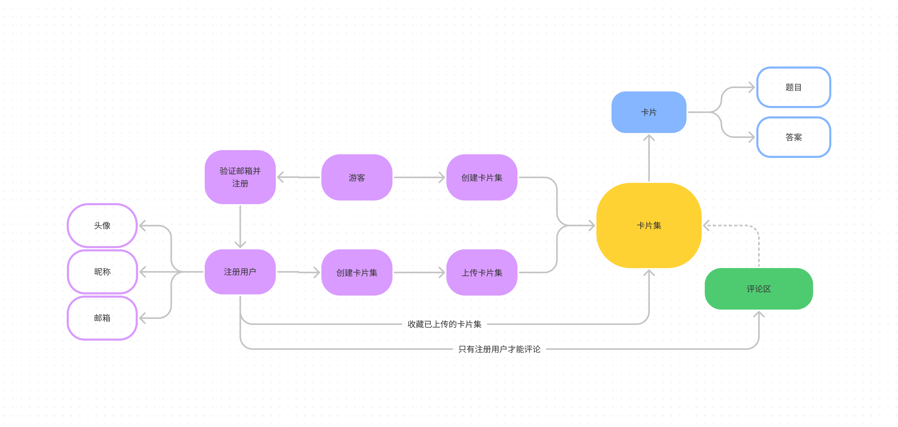

# Flicker 需求分析文档

## 产品描述

经过小组讨论我们决定以网站的形式实现我们的选课系统，在项目管理上使用 Github 平台对我们的代码和资源文件进行管理，构建用于存储用户信息和学习集信息的数据库，租用服务器用于部署我们的网站。我们的基本目标是在网页上实现一个背单词系统。

## 产品功能

学习系统针对不同用户实现不同的功能。
游客: 创建本地卡片集, 浏览卡片集信息, 学习, 但无法收藏和评论；
注册用户: 除游客功能外还可收藏发布卡片集, 评论；
管理员: 查看后台数据，进行权限和数据管理

## 系统用例

系统中最重要的角色是卡片集和用户，其用例图如下:

## 系统功能描述

基于 web 开发，因此初步设计以下界面:

- 注册登录
- 上传卡片集
- 编辑卡片集
- 卡片集详情
- 卡片集广场
- 问题详情
- 我的卡片集
- 我的主页
- 404

### 注册登录

[原型图界面](http://flicker-proto.woolensheep.top/login)

登录时支持找回密码, 通过邮箱接受验证码并注册, 60 秒内不可重复发送

### 上传卡片集

可给卡片集设置样式, 每道题支持自定义题目及答案, 支持通过上传文件批量创建

### 编辑卡片集

同上

### 卡片集详情

[原型图界面](http://flicker-proto.woolensheep.top/deck/intro/213)

可预览其热度, 题目数等信息, 可选择多种学习方式, 可收藏此卡片集.  
如是作者打开可编辑卡片集

### 卡片集广场

[原型图界面](http://flicker-proto.woolensheep.top/explore)

可浏览卡片简介

### 问题详情

[原型图界面](http://flicker-proto.woolensheep.top/deck/question/123)

每道题对应的学习界面, 通过多种方式进行学习(例为翻页卡片方式)

### 我的卡片集

[原型图界面](http://flicker-proto.woolensheep.top/home)

可浏览卡片简介

### 我的主页

[原型图界面](http://flicker-proto.woolensheep.top/user)

可修改个人信息
